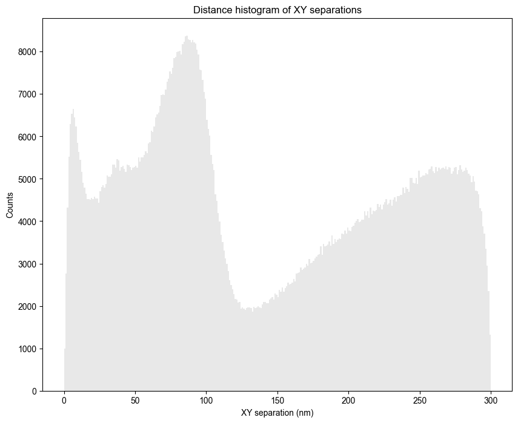
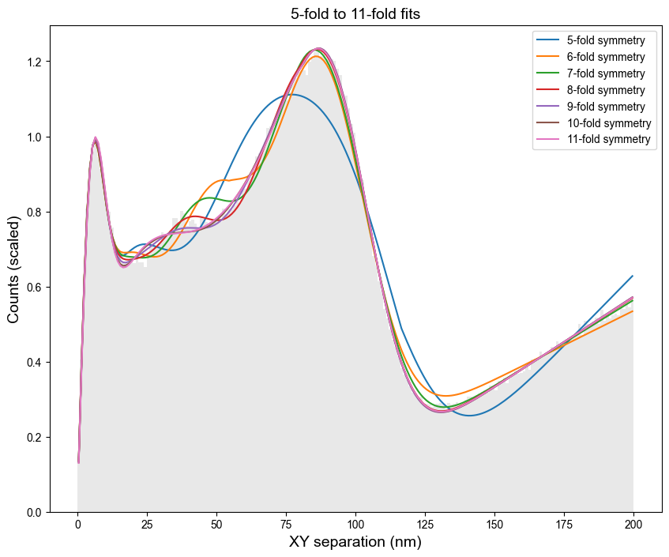
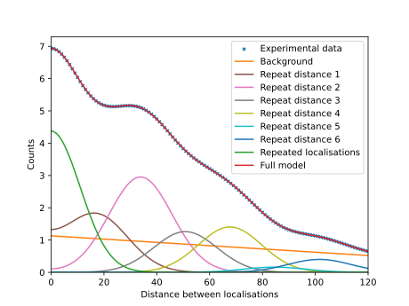

[](https://github.com/AlistairCurd/PERPL-Python3/blob/dev/LICENSE)
[](https://pypi.org/project/perpl)
[](https://python.org)
[](https://github.com/AlistairCurd/PERPL-Python3/actions/workflows/python-app.yml)

# PERPL

## Pattern Extraction from Relative Positions of Localisations

PERPL infers structure that is not directly visible in point-cloud data, including when data is sparse relative to the underlying structure. It was initially developed for localisation microscopy, but is also applicable to other point-cloud data.

PERPL works by computing pairwise relative positions between data points in a relative position distribution (RPD). It compares this experimental RPD with RPDs generated from candidate model structures and assists in final model selection.

Originally developed at the University of Leeds.

## Citation

If you use PERPL in your work, please cite:

Curd, A. P., Leng, J., Hughes, R. E., Cleasby, A. J., Rogers, B., Trinh, C. H.,
Baird, M. A., Takagi, Y., Tiede, C., Sieben, C., Manley, S., Schlichthaerle, T.,
Jungmann, R., Ries, J., Shroff, H., & Peckham, M.
Nanoscale Pattern Extraction from Relative Positions of Sparse 3D Localizations.
**Nano Letters** 2021, 21 (3), 1213–1220.
https://doi.org/10.1021/acs.nanolett.0c03332.

### BibTeX

```bibtex
@article{curd2021perpl,
  title = {Nanoscale Pattern Extraction from Relative Positions of Sparse 3D Localizations},
  author = {Curd, Alistair P. and Leng, Joanna and Hughes, Ruth E. and Cleasby, Alexa J. and Rogers, Brendan and Trinh, Chi H. and Baird, Michelle A. and Takagi, Yasuharu and Tiede, Christian and Sieben, Christian and Manley, Suliana and Schlichthaerle, Thomas and Jungmann, Ralf and Ries, Jonas and Shroff, Hari and Peckham, Michelle},
  journal = {Nano Letters},
  year = {2021},
  volume = {21},
  number = {3},
  pages = {1213--1220},
  doi = {10.1021/acs.nanolett.0c03332}
}
```


## Installation

Requires Python 3.11+ (e.g. in a new conda environment)

`pip install perpl` for released versions

or

Download or clone this repository and `pip install .`

Tested on Linux and Windows

## Quick start 

Input data should be a table of 2D or 3D data points in a CSV file, with one row per data point. The first columns must contain the X and Y coordinates (and Z for 3D data).

* Collect 2D relative positions (`-d 2`) with filter distance 200  (`-f 200`).

`relpos -i INPUT_DATA.csv -d 2 -f 200`

* Example analysis: radial symmetry modelling from the RPD. This uses output from the `relpos` command.

`rotsym2d -i RPD_DATA.csv`

* Example analysis: modelling independent and repeated distances from the RPD. Uses output from the `relpos` command and a modelling config model file based on `perpl_models_config.yaml`. Fit histograms of the distances (`-fh`).

`modeldistances -rf RPD_DATA.csv -cf CONFIG_FILE.yaml -fh`

Output is generated at the input data (and config file) location.

HTML reports are generated in the output for `relpos` and `rotsym2d`.

## Usage

The following commands are available:

* `relpos`/relative_positions.py generates the set of 2D/3D relative positions, plots of distance histograms and an HTML report.

  Here is one of the distance histograms for data from a nuclear pore complex protein (located around a ring of approx. 100 nm diameter):

  

* `rotsym2d`/rot_2d_symm_fit.py generates visualisations of fitted structures and fit results, and an HTML report containing detailed fit results and a comparison of the models for different orders of symmetry.

  Here is a plot with the fits to model RPDs with different orders of symmetry:

  

* `modeldistances`/run_distance_modelling.py generates a set of models to fit from copy of `perpl_models_config.yaml`, which the user may edit and rename as desired. It then generates visualisations of distance distibutions (histogram or kernel density estimate) and model fits, and a table comparing the different models.

  Here is an example plot produced for one model fit to a kernel density estimate of a distance distribution:

  

Run `COMMAND -h` to see available command-line options.

The `-s` flag can be used to shorten the output path if this becomes a problem in Windows.

Output is generated in a subdirectory to the directory containing the input data/RPD data.

See `src/perpl/` for all modules including structural model implementations.

## Data

The original test data for this software and examples with which the software can be used, can be found at 

 [https://bitbucket.org/apcurd/perpl_test_data](https://bitbucket.org/apcurd/perpl_test_data).

## Documentation

More detailed documentation is available in `dev/old-readme.md` and will be improved in future releases.

### Notebooks
See `notebooks/` for interactive examples, developed from work reported [here](https://doi.org/10.1021/acs.nanolett.0c03332).

## Authors

Alistair Curd, Oliver Umney, Joanna Leng

## License

Apache License 2.0 — see LICENSE file for details.
